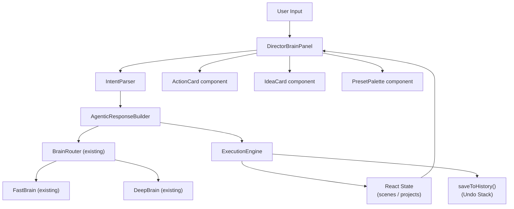

# Design Document: Director Agentic Mode

## Overview

Director Agentic Mode upgrades the existing `DirectorBrainPanel` from a read-only chat interface into an interactive cinematic co-director. The core interaction model is **propose + confirm**: the Director Brain diagnoses issues, proposes concrete named actions as clickable `Action_Card` components, and the `ExecutionEngine` applies confirmed actions to live React state.

The upgrade is purely additive — it extends `BrainRouter`, `DirectorBrainPanel`, and the existing Fast Brain rule layer. No existing behavior is removed or replaced.

### Key Design Decisions

1. **IntentParser is a pure JS object** (like `FastBrain`) — synchronous, rule-based, zero latency.
2. **AgenticResponseBuilder** sits between `BrainRouter` and the UI — it wraps `BrainRouter.route()` output and enriches it with `Action_Card` and `Idea_Card` payloads.
3. **ExecutionEngine** is a pure JS object that receives an `Action_Proposal` and a set of React state setters, applies the change, and calls `saveToHistory()` before mutating state.
4. **Session log** is local state inside `DirectorBrainPanel` — a plain array of `{ proposal, status }` entries, never persisted to localStorage.
5. **Proactive scan** runs in a `useEffect` on panel mount, calling `AgenticResponseBuilder.scan(projectSnapshot)` and injecting the result as the first bot message.

---

## Architecture



### Data Flow

1. User types a query → `DirectorBrainPanel.handleSubmit()`
2. `IntentParser.parse(query, snapshot)` → `ParsedIntent { category, scope, severity, isIdeasMode }`
3. `AgenticResponseBuilder.build(intent, snapshot, brainMode, engineRef)` → `AgenticResponse { text, actionCards, ideaCards }`
4. `AgenticResponse` is stored in `messages` state as a structured message object
5. Renderer maps `actionCards` → `<ActionCard>` components, `ideaCards` → `<IdeaCard>` components
6. User clicks Confirm on an `ActionCard` → `ExecutionEngine.apply(proposal, appActions)` → state update + undo push

---

## Components and Interfaces

### IntentParser (module-scope plain JS object)

```js
const IntentParser = {
  // Returns ParsedIntent or null if unrecognized
  parse(query, projectSnapshot) { ... },

  // Returns true if query is an ideas-mode trigger
  isIdeasQuery(query) { ... },

  // Resolves "scene 2" / "the third shot" / "my opening" to entity
  resolveReference(query, projectSnapshot) { ... },
};
```

**ParsedIntent shape:**
```js
{
  category: 'pacing' | 'tension' | 'coverage' | 'continuity' |
            'style' | 'emotional_arc' | 'structure' | 'character_presence' |
            'ideas' | 'informational' | 'unknown',
  scope: { type: 'scene' | 'shot' | 'project', id: string | null, index: number | null },
  severity: 'critical' | 'moderate' | 'minor' | null,
  rawQuery: string,
  isIdeasMode: boolean,
}
```

**Intent recognition rules** (Fast Brain pattern matching, all synchronous):

| Trigger patterns | Category |
|---|---|
| `flat`, `no tension`, `boring`, `pacing drags`, `too slow`, `too fast`, `rhythm` | `pacing` |
| `tension`, `escalat`, `climax`, `stakes`, `act 2` | `tension` |
| `coverage`, `establish`, `missing shot`, `close.?up` | `coverage` |
| `continuity`, `consistent`, `match`, `costume`, `location` | `continuity` |
| `style`, `rewrite`, `kubrick`, `nolan`, `villeneuve` | `style` |
| `emotion`, `feeling`, `arc`, `missing beat` | `emotional_arc` |
| `structure`, `act`, `midpoint`, `cold open`, `act break` | `structure` |
| `character`, `actor`, `presence`, `missing character` | `character_presence` |
| `idea`, `inspire`, `creative`, `what if`, `how could`, `more cinematic` | `ideas` |

**Colloquial term mapping:**
- `cold open` → `structure`
- `act break` → `structure`
- `money shot` → `coverage`
- `coverage` → `coverage`
- `motivated cut` → `pacing`
- `eyeline match` → `continuity`

---

### AgenticResponseBuilder (module-scope plain JS object)

```js
const AgenticResponseBuilder = {
  // Main entry point — builds a full AgenticResponse
  async build(intent, projectSnapshot, brainMode, deepBrainEngineRef, sessionLog) { ... },

  // Proactive scan on panel open — returns highest-priority AgenticResponse or null
  scan(projectSnapshot) { ... },

  // Builds Action_Cards from a diagnostic result
  buildActionCards(diagnosticResult, projectSnapshot, sessionLog) { ... },

  // Builds Idea_Cards for ideas-mode queries
  buildIdeaCards(intent, projectSnapshot) { ... },

  // Expands an Idea_Card into concrete Action_Cards
  expandIdea(ideaCard, projectSnapshot) { ... },
};
```

**AgenticResponse shape:**
```js
{
  text: string,           // Diagnostic paragraph (≤4 sentences)
  actionCards: ActionProposal[],  // 0–5 items
  ideaCards: IdeaCard[],          // 0–3 items
  closingNote: string,    // "What to do next" sentence
  source: 'fast' | 'deep',
}
```

**Integration with BrainRouter:**
`AgenticResponseBuilder.build()` calls `BrainRouter.route()` for the text portion, then post-processes the result to extract structured action proposals. The existing `BrainRouter` routing logic (Fast Brain pattern match → Deep Brain fallback) is preserved unchanged. `AgenticResponseBuilder` wraps it — it does not replace it.

```js
async build(intent, snapshot, brainMode, engineRef, sessionLog) {
  // 1. Get text response from existing BrainRouter
  const { source, response } = await BrainRouter.route(
    intent.rawQuery, snapshot, brainMode, engineRef
  );
  // 2. Build action cards based on intent category + snapshot analysis
  const actionCards = this.buildActionCards(intent, snapshot, sessionLog);
  // 3. Build idea cards if ideas mode
  const ideaCards = intent.isIdeasMode ? this.buildIdeaCards(intent, snapshot) : [];
  return { text: response, actionCards, ideaCards, closingNote: ..., source };
}
```

**Session log deduplication:** Before adding an action card, `buildActionCards()` checks `sessionLog` for any entry with matching `type + targetId + params` and `status === 'applied'`. If found, the card is skipped.

---

### ExecutionEngine (module-scope plain JS object)

```js
const ExecutionEngine = {
  // Validates and applies a confirmed Action_Proposal
  // Returns { success: boolean, error?: string }
  apply(proposal, appActions) { ... },

  // Validates proposal against current project state
  // Returns { valid: boolean, reason?: string }
  validate(proposal, appActions) { ... },
};
```

`appActions` is the same object passed to `buildProjectSnapshot()` — it contains `scenes`, `activeSceneId`, `activeProjectId`, `updateActiveProjectScenes`, `setProjects`, `setActiveSceneId`, and `saveToHistory`.

**Execution pattern for all action types:**
```js
apply(proposal, appActions) {
  const validation = this.validate(proposal, appActions);
  if (!validation.valid) return { success: false, error: validation.reason };

  appActions.saveToHistory();  // Push to undo stack BEFORE mutation
  // ... apply state change via appActions.updateActiveProjectScenes(...)
  return { success: true };
}
```

**Action type implementations:**

| Action_Type | State mutation |
|---|---|
| `ADD_SHOT` | `updateActiveProjectScenes`: insert new shot at `payload.position` in `payload.sceneId` |
| `REWRITE_SHOT` | `updateActiveProjectScenes`: apply `FastBrain.applyDirectorStyle()` fields to target shot |
| `REORDER_SHOTS` | `updateActiveProjectScenes`: splice shot from current index, insert at `payload.toIndex` |
| `DELETE_SHOT` | `updateActiveProjectScenes`: filter out shot by `payload.shotId` |
| `APPLY_STYLE` | `updateActiveProjectScenes`: apply `DIRECTOR_STYLES[payload.style]` fields to all `payload.shotIds` |
| `SPLIT_SCENE` | `updateActiveProjectScenes`: split scene at `payload.splitIndex`, create new scene with tail shots |
| `ADD_SCENE` | `updateActiveProjectScenes`: insert new empty scene at `payload.position` |
| `SET_FIELD` | `updateActiveProjectScenes`: set `shot.selections[payload.field] = payload.value` on target shot |
| `APPLY_PRESET` | `updateActiveProjectScenes`: merge all preset fields into `shot.selections` for all `payload.shotIds` |

**Validation rules:**
- `ADD_SHOT`: `payload.sceneId` must exist in `scenes`; `payload.position` must be `0 ≤ pos ≤ scene.shots.length`
- `REWRITE_SHOT` / `DELETE_SHOT` / `SET_FIELD` / `APPLY_PRESET`: target shot must exist by `payload.shotId`
- `REORDER_SHOTS`: shot must exist; `payload.toIndex` must be valid
- `APPLY_STYLE`: `payload.style` must be a key in `DIRECTOR_STYLES`; all `payload.shotIds` must exist
- `SPLIT_SCENE`: scene must exist; `payload.splitIndex` must be `1 ≤ idx < scene.shots.length`
- `ADD_SCENE`: `payload.position` must be `0 ≤ pos ≤ scenes.length`

---

### ActionCard React Component

```jsx
const ActionCard = ({ proposal, onConfirm, onReject }) => { ... }
```

**Props:**
- `proposal: ActionProposal` — the full proposal object
- `onConfirm: (proposal) => void` — called when user clicks Confirm
- `onReject: (proposal) => void` — called when user clicks Reject

**ActionProposal shape:**
```js
{
  id: string,           // unique per response
  type: ActionType,     // e.g. 'ADD_SHOT'
  label: string,        // imperative label, e.g. "Add EWS before shot 1"
  rationale: string,    // one-line cinematic rationale
  targetSceneId: string | null,
  targetShotId: string | null,
  payload: object,      // type-specific parameters
  status: 'pending' | 'confirmed' | 'applied' | 'rejected',
}
```

**Visual states:**
- `pending`: gold border, Confirm (gold) + Reject (muted) buttons
- `applied`: green tint, "✓ Applied" label, buttons hidden
- `rejected`: muted/strikethrough, "✗ Rejected" label, buttons hidden
- `error`: red tint, inline error message

**Status updates in-place** — `ActionCard` receives `status` as a prop derived from the parent `messages` state. The parent updates the specific message's `actionCards[i].status` without re-rendering the full thread.

---

### IdeaCard React Component

```jsx
const IdeaCard = ({ idea, onExplore, onDismiss }) => { ... }
```

**Props:**
- `idea: IdeaCardData` — the idea object
- `onExplore: (idea) => void` — expands idea into Action_Cards
- `onDismiss: (idea) => void` — marks dismissed

**IdeaCardData shape:**
```js
{
  id: string,
  title: string,           // concept title
  rationale: string,       // ≤3 sentences cinematic rationale
  shotSequence: string,    // e.g. "EWS → MS → CU (push-in reveal)"
  status: 'pending' | 'explored' | 'dismissed',
}
```

**Visual distinction from ActionCard:** IdeaCard uses a cyan/purple gradient border (vs. gold for ActionCard) and a "💡 IDEA" badge instead of an action type badge.

---

### PresetPalette React Component

```jsx
const PresetPalette = ({ isOpen, onClose, onSelectPreset, projectSnapshot }) => { ... }
```

**Props:**
- `isOpen: boolean`
- `onClose: () => void`
- `onSelectPreset: (preset) => void` — called with the selected preset; parent creates an `APPLY_PRESET` ActionCard
- `projectSnapshot: ProjectSnapshot` — used for contextual relevance scoring

**Behavior:** Renders as a slide-in panel (not a modal) within the `DirectorBrainPanel`. Displays all `SHOT_PRESETS` as browsable cards. Contextual relevance scoring ranks presets by matching the active scene's lighting and mood fields.

---

## Data Models

### SHOT_PRESETS constant (extended for Director Agentic Mode)

The existing `SHOT_PRESETS` array is extended with a new `directorPresets` sub-library specifically for the Director Brain. These are distinct from the existing filmstrip presets — they are named cinematic recipes with a `description` field for display in the `PresetPalette`.

```js
const DIRECTOR_SHOT_PRESETS = [
  {
    name: "Golden Hour CU",
    shotType: "Close-Up (CU)",
    lens: "85mm Portrait",
    lighting: "Golden Hour",
    mood: "Warm & Cinematic",
    subjectNote: "Subject bathed in warm backlight, slight lens flare",
    description: "Intimate close-up in warm golden light — ideal for emotional reveals.",
    category: "Emotional",
  },
  {
    name: "Noir Interrogation MS",
    shotType: "Medium Shot (MS)",
    lens: "35mm Standard",
    lighting: "Low Key (Dark/Moody)",
    mood: "Tense",
    subjectNote: "Single overhead practical light, deep shadows on face",
    description: "Classic noir interrogation framing — high contrast, psychological pressure.",
    category: "Tension",
  },
  {
    name: "Handheld Chase WS",
    shotType: "Wide Shot (WS)",
    lens: "24mm Wide",
    lighting: "Natural Daylight",
    mood: "Urgent",
    subjectNote: "Subject running, camera tracking at shoulder height",
    description: "Kinetic handheld wide — urgency and spatial disorientation.",
    category: "Action",
  },
  {
    name: "Kubrick Symmetry WS",
    shotType: "Wide Shot (WS)",
    lens: "14mm Ultra-Wide",
    lighting: "High Key (Bright)",
    mood: "Cold & Clinical",
    subjectNote: "Subject centered, perfectly symmetrical environment",
    description: "Kubrick's signature symmetrical wide — cold, controlled, unsettling.",
    category: "Style",
  },
  // Additional presets...
];
```

**Preset fields used by `APPLY_PRESET` execution:**
`shotType`, `lens`, `lighting`, `mood`, `subjectNote` — all mapped to `shot.selections.*` fields.

### Session Log entry

```js
{
  proposalId: string,
  type: ActionType,
  targetSceneId: string | null,
  targetShotId: string | null,
  paramsHash: string,   // JSON.stringify of payload for deduplication
  status: 'applied' | 'rejected',
  appliedAt: number,    // Date.now()
}
```

### Message object (extended)

The existing `messages` state array in `DirectorBrainPanel` is extended to support structured agentic messages:

```js
{
  role: 'user' | 'assistant',
  content: string,           // plain text portion
  source: 'fast' | 'deep',
  // New agentic fields:
  actionCards: ActionProposal[],  // [] for non-agentic messages
  ideaCards: IdeaCardData[],      // [] for non-agentic messages
  closingNote: string,
}
```

---

## Correctness Properties

*A property is a characteristic or behavior that should hold true across all valid executions of a system — essentially, a formal statement about what the system should do. Properties serve as the bridge between human-readable specifications and machine-verifiable correctness guarantees.*

### Property 1: Intent reference resolution round-trip

*For any* project snapshot with N scenes and M shots per scene, and any reference string of the form "scene K", "shot K", or "my opening", `IntentParser.resolveReference()` SHALL return the entity at the correct index, and that entity SHALL be present in the snapshot.

**Validates: Requirements 1.3**

---

### Property 2: No state change without confirmation

*For any* `ActionProposal` of any type, calling `ExecutionEngine.apply()` without a preceding `saveToHistory()` call (i.e., without the confirmation path being triggered) SHALL leave the `scenes` array structurally identical to its pre-call state. Equivalently: the Project_State SHALL NOT change unless the user explicitly confirms the proposal.

**Validates: Requirements 4.1, 4.3, 4.5, 10.5**

---

### Property 3: Execution correctness for all action types

*For any* valid project state and any valid `ActionProposal` of any of the 9 supported `Action_Types`, confirming the proposal via `ExecutionEngine.apply()` SHALL produce a project state that reflects exactly the described change — no more, no less — and all other scenes and shots SHALL remain unchanged.

**Validates: Requirements 4.2, 5.1, 5.2, 5.3, 5.4, 5.5, 5.6, 5.7, 5.8, 5.9**

---

### Property 4: Invalid proposals are rejected without state mutation

*For any* `ActionProposal` whose `targetShotId` or `targetSceneId` does not exist in the current project state, or whose `payload` parameters are out of bounds, `ExecutionEngine.validate()` SHALL return `{ valid: false }` and `ExecutionEngine.apply()` SHALL return `{ success: false }` without modifying the `scenes` array.

**Validates: Requirements 4.8, 10.4**

---

### Property 5: Undo stack integrity after action application

*For any* valid `ActionProposal` that is confirmed and applied, the `historyPast` array SHALL grow by exactly 1 entry, and calling `handleUndo()` immediately after SHALL restore the `scenes` array to its exact pre-application state.

**Validates: Requirements 4.7, 11.8**

---

### Property 6: Action_Card count invariant

*For any* project state and any query, `AgenticResponseBuilder.build()` SHALL return an `AgenticResponse` where `actionCards.length ≤ 5`.

**Validates: Requirements 3.7**

---

### Property 7: Idea_Card count invariant

*For any* project state and any ideas-mode query, `AgenticResponseBuilder.build()` SHALL return an `AgenticResponse` where `ideaCards.length ≤ 3`.

**Validates: Requirements 12.8**

---

### Property 8: Action_Card structural completeness

*For any* `ActionProposal` generated by `AgenticResponseBuilder`, the proposal object SHALL have all of the following fields non-null and non-empty: `id`, `type`, `label`, `rationale`, `status`. The `type` SHALL be one of the 9 supported `Action_Types`.

**Validates: Requirements 3.2, 7.4, 7.5**

---

### Property 9: Session log deduplication

*For any* session where an `ActionProposal` of type T targeting entity E has been applied, subsequent calls to `AgenticResponseBuilder.build()` for queries that would normally produce the same proposal SHALL NOT include that proposal in the returned `actionCards`.

**Validates: Requirements 8.2**

---

### Property 10: No generic phrases in diagnostic responses

*For any* project state and any query that produces a diagnostic response, the `text` field of the `AgenticResponse` SHALL NOT contain any of the following substrings: "looks good", "seems fine", "you might want to consider", "could be better", "not bad".

**Validates: Requirements 2.6, 6.1**

---

### Property 11: Coverage diagnosis identifies specific missing shots

*For any* scene with a known coverage gap (no establishing shot, or no close-up), `AgenticResponseBuilder.build()` for a coverage query SHALL return a `text` response that references the specific missing shot type by name (e.g., "EWS", "establishing shot", "CU", "close-up").

**Validates: Requirements 2.5**

---

### Property 12: Ideas-mode routing

*For any* query that `IntentParser.isIdeasQuery()` returns `true` for, `AgenticResponseBuilder.build()` SHALL return an `AgenticResponse` where `ideaCards.length > 0`. Conversely, for any query where `isIdeasQuery()` returns `false`, the response SHALL NOT contain `ideaCards` generated from the ideas path.

**Validates: Requirements 12.1, 12.10**

---

### Property 13: Independent card confirmation

*For any* `AgenticResponse` containing N Action_Cards (N ≥ 2), confirming card at index I SHALL update only `actionCards[I].status` to `'applied'` and SHALL leave all other cards' statuses unchanged.

**Validates: Requirements 4.6**

---

## Error Handling

### ExecutionEngine errors

- **Target not found**: Shot or scene referenced by `targetShotId`/`targetSceneId` no longer exists (user may have deleted it between proposal and confirmation). → Return `{ success: false, error: 'Target shot no longer exists' }`. ActionCard renders inline error, status set to `'rejected'`.
- **Out-of-bounds position**: `ADD_SHOT` or `ADD_SCENE` with `position > length`. → Clamp to end of array rather than error, log a warning.
- **Invalid style name**: `APPLY_STYLE` with unknown style key. → Return `{ success: false, error: 'Unknown director style' }`.
- **Split at invalid index**: `SPLIT_SCENE` with `splitIndex === 0` or `splitIndex >= scene.shots.length`. → Return `{ success: false, error: 'Cannot split at this position' }`.

### IntentParser fallback

- If `parse()` returns `category: 'unknown'`, `AgenticResponseBuilder.build()` falls through to `BrainRouter.route()` for a plain text response with no Action_Cards. The response text is a clarifying question using cinematic vocabulary.

### Proactive scan errors

- If `AgenticResponseBuilder.scan()` throws (e.g., empty project), it returns `null` and no proactive message is injected. The panel opens with the standard empty state.

### Deep Brain timeout

- The existing 30-second timeout in `DirectorBrainPanel.handleSubmit()` is preserved. If timeout fires, the agentic response is discarded and a timeout message is shown with no Action_Cards.

---

## Testing Strategy

### Unit tests (example-based)

- `IntentParser.parse()` — one test per intent category with a representative query
- `IntentParser.resolveReference()` — test "scene 1", "scene 3", "my opening", "the last shot"
- `IntentParser.isIdeasQuery()` — test each trigger phrase
- `ExecutionEngine.validate()` — test each action type with valid and invalid payloads
- `DIRECTOR_SHOT_PRESETS` — verify all 4 required presets exist with all required fields
- `AgenticResponseBuilder.scan()` — test with empty project, single-scene project, multi-scene project

### Property-based tests

The feature uses property-based testing for all universal correctness properties listed above. The recommended library is **fast-check** (already available in the browser environment via CDN, or can be loaded inline).

Each property test runs a minimum of **100 iterations**.

Tag format: `// Feature: director-agentic-mode, Property N: <property_text>`

**Generator definitions:**

```js
// Random project snapshot
const arbSnapshot = fc.record({
  scenes: fc.array(fc.record({
    id: fc.string(),
    name: fc.string(),
    shots: fc.array(fc.record({
      id: fc.string(),
      selections: fc.record({
        shotType: fc.constantFrom('Wide Shot (WS)', 'Close-Up (CU)', 'Medium Shot (MS)', 'Extreme Wide Shot (EWS)', 'Extreme Close-Up (ECU)'),
        lighting: fc.string(),
        lens: fc.string(),
      }),
      subject: fc.string(),
    }), { minLength: 0, maxLength: 8 }),
  }), { minLength: 1, maxLength: 5 }),
});

// Random valid action proposal
const arbProposal = (snapshot) => fc.oneof(
  fc.record({ type: fc.constant('ADD_SHOT'), ... }),
  fc.record({ type: fc.constant('DELETE_SHOT'), ... }),
  // ... one per action type
);
```

**Property test structure (example for Property 3):**
```js
// Feature: director-agentic-mode, Property 3: Execution correctness for all action types
fc.assert(fc.asyncProperty(arbSnapshot, arbProposal, async (snapshot, proposal) => {
  const appActions = mockAppActions(snapshot);
  const result = ExecutionEngine.apply(proposal, appActions);
  if (result.success) {
    verifyExpectedTransformation(proposal, appActions.capturedState);
  }
}), { numRuns: 100 });
```

### Integration points to verify manually

- `DirectorBrainPanel` renders `ActionCard` components inline within `lg-bubble-bot` bubbles
- `ActionCard` Confirm button triggers `ExecutionEngine.apply()` with correct `appActions` reference
- `saveToHistory()` is called before every state mutation in `ExecutionEngine`
- Proactive scan fires on panel mount (`useEffect` with `[]` dependency)
- `Cmd+D` / `Ctrl+D` shortcut continues to open the Director Brain panel (existing behavior unchanged)
- Example query chips are updated to reflect agentic capabilities
