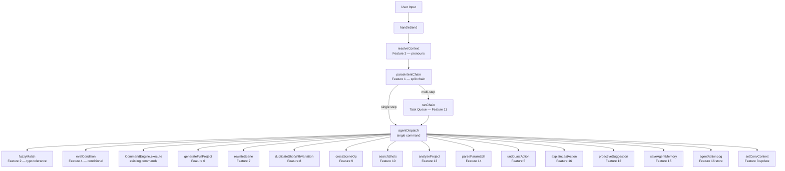
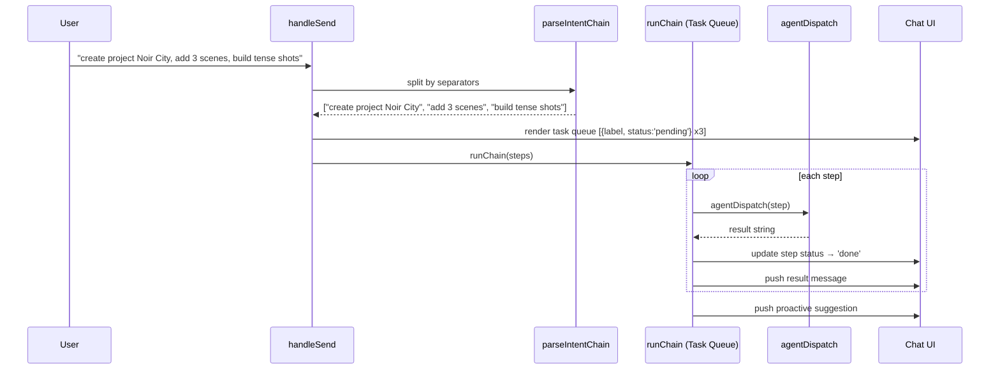
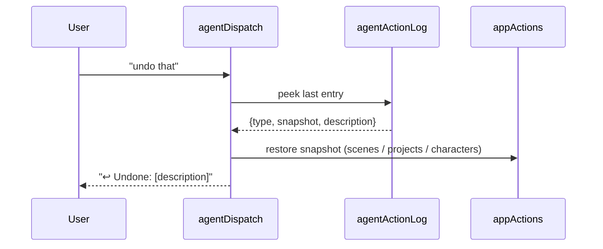
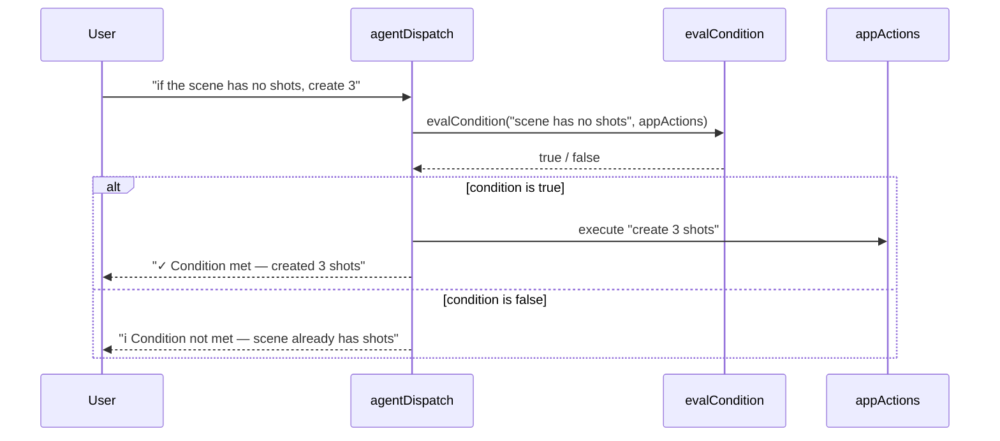

# Design Document: mokha-agent-engine

## Overview

The MOKHA Agent Engine upgrades the existing `LocalAssistant` chat component from a simple pattern-matching dispatcher into a true agent loop capable of chaining multi-step commands, resolving pronouns from conversation context, evaluating live app state conditionally, undoing actions, running task queues with live progress, and persisting memory across browser sessions — all 100% offline with no external API.

The 16 capabilities are already partially scaffolded as standalone utility functions (`fuzzyMatch`, `parseIntentChain`, `resolveContext`, `parseParamEdit`, `searchShots`, `generateFullProject`, `analyzeProject`, `rewriteScene`, `duplicateShotWithVariation`, `crossSceneOp`, `loadAgentMemory`, `saveAgentMemory`). The missing piece is a unified **agent dispatch loop** inside `handleSend` that wires all of them together, plus the UI state and rendering for task queues, undo, proactive suggestions, and the explain mode.

---

## Architecture



---

## Sequence Diagrams

### Multi-Step Chain Execution (Features 1 + 11)



### Undo Last Action (Feature 5)



### Conditional Logic (Feature 4)



---

## Components and Interfaces

### Component 1: `agentDispatch(step, appActions, convContext)`

**Purpose**: Single-step intent router — the heart of the agent loop. Receives one resolved, de-chained command string and routes it to the correct capability.

**Interface**:
```typescript
interface AgentDispatchResult {
  text: string;           // reply to show in chat
  type?: string;          // 'action' | 'search' | 'info' | 'error'
  snapshot?: AppSnapshot; // state before action (for undo)
  contextUpdate?: Partial<ConvContext>;
  suggestion?: string;    // proactive next-step hint
}

function agentDispatch(
  step: string,
  appActions: AppActions,
  convContext: ConvContext
): AgentDispatchResult
```

**Responsibilities**:
- Apply fuzzy matching to director/mood names
- Detect conditional patterns and evaluate them
- Route to the correct feature handler
- Capture a state snapshot before mutating state (for undo)
- Return a structured result including suggestion and context update

---

### Component 2: `runChain(steps, appActions, convContext, callbacks)`

**Purpose**: Executes an array of steps sequentially with async delays, updating the task queue UI after each step.

**Interface**:
```typescript
interface ChainCallbacks {
  onStepStart: (index: number) => void;
  onStepDone: (index: number, result: AgentDispatchResult) => void;
  onStepError: (index: number, error: string) => void;
  onChainComplete: (results: AgentDispatchResult[]) => void;
}

function runChain(
  steps: string[],
  appActions: AppActions,
  convContext: ConvContext,
  callbacks: ChainCallbacks
): void
```

**Responsibilities**:
- Iterate steps with `setTimeout` staggering (300ms between steps)
- Call `agentDispatch` for each step
- Invoke callbacks to update task queue state
- After all steps, emit a proactive suggestion based on the last result

---

### Component 3: `buildSnapshot(appActions)`

**Purpose**: Captures a lightweight snapshot of mutable app state before any destructive operation, enabling undo.

**Interface**:
```typescript
interface AppSnapshot {
  scenes: Scene[];
  projects: Project[];
  activeSceneId: string | number;
  activeProjectId: string;
  globalCharacters: Character[];
  globalLocations: Location[];
  globalVoiceStyles: VoiceStyle[];
  description: string; // human-readable label for undo message
}

function buildSnapshot(appActions: AppActions, description: string): AppSnapshot
```

---

### Component 4: `restoreSnapshot(snapshot, appActions)`

**Purpose**: Applies a previously captured snapshot back to app state.

**Interface**:
```typescript
function restoreSnapshot(snapshot: AppSnapshot, appActions: AppActions): void
```

---

### Component 5: `getProactiveSuggestion(lastResult, appActions)`

**Purpose**: After each agent action, returns a contextually relevant next-step suggestion.

**Interface**:
```typescript
function getProactiveSuggestion(
  lastResult: AgentDispatchResult,
  appActions: AppActions
): string | null
```

**Logic**:
- After `CREATE_PROJECT` → suggest "add a scene"
- After `CREATE_SCENE` → suggest "add shots or rewrite in a director style"
- After `generateFullProject` → suggest "analyze my project"
- After `rewriteScene` → suggest "duplicate a shot with variation"
- After `searchShots` with results → suggest "change [param] in those shots"
- After `analyzeProject` → suggest "fix issues" or "rewrite scene"

---

## Data Models

### `ConvContext`

Tracks the last-created entities so pronoun resolution works across turns.

```typescript
interface ConvContext {
  lastCreatedProject?: string;   // project name
  lastCreatedScene?: string;     // scene name
  lastCreatedShot?: string;      // shot subject
  lastCreatedChar?: string;
  lastCreatedLoc?: string;
  lastCreatedVoice?: string;
  lastShotIndex?: number;        // 0-based index in active scene
  lastDirectorApplied?: string;
  lastMoodApplied?: string;
  lastSearchResults?: SearchResult[];
  lastActionType?: string;       // for "explain what you just did"
}
```

### `TaskQueueItem`

```typescript
interface TaskQueueItem {
  label: string;                          // human-readable step description
  status: 'pending' | 'running' | 'done' | 'error';
  result?: string;                        // short result summary
}
```

### `AgentActionLogEntry`

```typescript
interface AgentActionLogEntry {
  id: string;
  timestamp: number;
  description: string;           // "Created project 'Noir City'"
  snapshot: AppSnapshot;         // state before this action
  resultText: string;            // what the agent replied
  featureId: number;             // 1–16
}
```

### `SearchResult`

```typescript
interface SearchResult {
  scene: string;
  shotNum: number;
  shot: Shot;
}
```

---

## Key Functions with Formal Specifications

### `agentDispatch(step, appActions, convContext)`

**Preconditions**:
- `step` is a non-empty, already-resolved (pronoun-free) string
- `appActions` contains valid React state setters
- `convContext` may be empty `{}`

**Postconditions**:
- Returns an `AgentDispatchResult` with a non-empty `text` field
- If the action mutated app state, `snapshot` is populated
- `contextUpdate` reflects any new entities created
- No unhandled exceptions escape (all branches return a result)

**Loop Invariants**: N/A (no loops; pure routing switch)

---

### `runChain(steps, appActions, convContext, callbacks)`

**Preconditions**:
- `steps.length >= 2`
- All callbacks are functions

**Postconditions**:
- `onStepDone` is called exactly once per step
- `onChainComplete` is called exactly once after all steps
- Steps execute in order (step N+1 starts only after step N completes)

**Loop Invariants**:
- After processing step `i`, all steps `0..i` have status `'done'` or `'error'`
- `convContext` is updated cumulatively after each step

---

### `buildSnapshot(appActions, description)`

**Preconditions**:
- `appActions` has `scenes`, `projects`, `globalCharacters`, `globalLocations`, `globalVoiceStyles`

**Postconditions**:
- Returns a deep-cloned snapshot (no shared references with live state)
- `description` is preserved verbatim

---

## Algorithmic Pseudocode

### Main Agent Dispatch Algorithm

```pascal
ALGORITHM agentDispatch(step, appActions, convContext)
INPUT: step: String, appActions: AppActions, convContext: ConvContext
OUTPUT: result: AgentDispatchResult

BEGIN
  q ← step.toLowerCase()
  snapshot ← null
  suggestion ← null
  contextUpdate ← {}

  // ── Feature 5: Undo ──────────────────────────────────────────────
  IF q MATCHES /^undo|undo that|undo last/ THEN
    RETURN undoLastAction(appActions)
  END IF

  // ── Feature 16: Explain ─────────────────────────────────────────
  IF q MATCHES /explain|what did you do|what just happened/ THEN
    RETURN explainLastAction(agentActionLog)
  END IF

  // ── Feature 13: Analyze ─────────────────────────────────────────
  IF q MATCHES /analyze|analysis|project report|check project/ THEN
    report ← analyzeProject(appActions)
    RETURN formatAnalysisReport(report)
  END IF

  // ── Feature 6: Full Project Generator ───────────────────────────
  IF q MATCHES /generate.*project|build.*complete|create.*film.*scenes/ THEN
    snapshot ← buildSnapshot(appActions, "Generate full project")
    result ← generateFullProject(step, appActions)
    applyGeneratedProject(result, appActions)
    suggestion ← "analyze my project"
    RETURN { text: formatProjectGenResult(result), snapshot, suggestion }
  END IF

  // ── Feature 7: Scene Rewriter ────────────────────────────────────
  IF q MATCHES /rewrite.*shots|rewrite.*scene|all shots.*style|.*style.*all shots/ THEN
    snapshot ← buildSnapshot(appActions, "Rewrite scene")
    result ← rewriteScene(step, appActions)
    IF result = null THEN RETURN { text: "⚠ No director or mood detected. Try 'rewrite in Fincher style'." } END IF
    suggestion ← "duplicate a shot with variation"
    RETURN { text: formatRewriteResult(result), snapshot, suggestion }
  END IF

  // ── Feature 8: Shot Duplicator ───────────────────────────────────
  IF q MATCHES /duplicate.*shot|clone.*shot|copy.*shot.*variation/ THEN
    shotIdx ← extractShotIndex(q, convContext)
    variationDesc ← extractVariationDesc(q)
    snapshot ← buildSnapshot(appActions, "Duplicate shot")
    result ← duplicateShotWithVariation(shotIdx, variationDesc, appActions)
    RETURN { text: formatDuplicateResult(result), snapshot }
  END IF

  // ── Feature 9: Cross-Scene Operations ───────────────────────────
  IF q MATCHES /copy.*shots.*from|merge.*scene/ THEN
    snapshot ← buildSnapshot(appActions, "Cross-scene operation")
    result ← crossSceneOp(step, appActions)
    RETURN { text: formatCrossSceneResult(result), snapshot }
  END IF

  // ── Feature 10: Smart Search ─────────────────────────────────────
  IF q MATCHES /find|search|show.*shots.*with|list.*shots.*with/ THEN
    results ← searchShots(step, appActions)
    contextUpdate.lastSearchResults ← results
    RETURN { text: formatSearchResults(results), contextUpdate }
  END IF

  // ── Feature 14: Parameter Edit ───────────────────────────────────
  paramEdit ← parseParamEdit(step, appActions)
  IF paramEdit ≠ null THEN
    snapshot ← buildSnapshot(appActions, "Edit shot parameter")
    applyParamEdit(paramEdit, appActions)
    RETURN { text: formatParamEditResult(paramEdit), snapshot }
  END IF

  // ── Feature 4: Conditional Logic ─────────────────────────────────
  condMatch ← step.match(/if\s+(.+?),?\s+(?:then\s+)?(.+)/i)
  IF condMatch ≠ null THEN
    condition ← condMatch[1]
    action ← condMatch[2]
    condResult ← evalCondition(condition, appActions)
    IF condResult = true THEN
      RETURN agentDispatch(action, appActions, convContext)
    ELSE IF condResult = false THEN
      RETURN { text: "ℹ Condition not met: " + condition }
    END IF
  END IF

  // ── Feature 2: Fuzzy Director/Mood ───────────────────────────────
  dirKey ← fuzzyFindDirector(q)
  IF dirKey ≠ null THEN
    snapshot ← buildSnapshot(appActions, "Apply director style")
    applyDirectorStyle(dirKey, appActions)
    RETURN { text: formatDirectorResult(dirKey), snapshot }
  END IF

  moodKey ← fuzzyFindMood(q)
  IF moodKey ≠ null THEN
    snapshot ← buildSnapshot(appActions, "Apply mood")
    applyMoodPreset(moodKey, appActions)
    RETURN { text: formatMoodResult(moodKey), snapshot }
  END IF

  // ── Existing CommandEngine ────────────────────────────────────────
  cmd ← CommandEngine.parse(step)
  IF cmd ≠ null THEN
    snapshot ← buildSnapshot(appActions, cmd.type)
    cmdResult ← CommandEngine.execute(cmd, appActions)
    IF cmdResult ≠ null THEN
      contextUpdate ← extractContextFromCmd(cmd)
      RETURN { text: cmdResult, snapshot, contextUpdate }
    END IF
  END IF

  // ── Fallback: Knowledge Base ──────────────────────────────────────
  kbResult ← AssistantEngine.ask(step, {})
  RETURN { text: kbResult.text }
END
```

---

### Chain Runner Algorithm

```pascal
ALGORITHM runChain(steps, appActions, convContext, callbacks)
INPUT: steps: String[], appActions: AppActions, convContext: ConvContext, callbacks: ChainCallbacks
OUTPUT: void (side effects via callbacks)

BEGIN
  ASSERT steps.length >= 2
  results ← []
  currentContext ← convContext

  FOR i ← 0 TO steps.length - 1 DO
    ASSERT all steps[0..i-1] have status 'done' or 'error'

    callbacks.onStepStart(i)

    WAIT 300ms  // stagger for UI feedback

    result ← agentDispatch(steps[i], appActions, currentContext)
    results.append(result)

    IF result.contextUpdate ≠ null THEN
      currentContext ← merge(currentContext, result.contextUpdate)
    END IF

    IF result.snapshot ≠ null THEN
      pushToActionLog(result.snapshot, result.text)
    END IF

    callbacks.onStepDone(i, result)
  END FOR

  suggestion ← getProactiveSuggestion(results[results.length - 1], appActions)
  callbacks.onChainComplete(results, suggestion)
END
```

---

### Undo Algorithm

```pascal
ALGORITHM undoLastAction(agentActionLog, appActions)
INPUT: agentActionLog: AgentActionLogEntry[], appActions: AppActions
OUTPUT: AgentDispatchResult

BEGIN
  IF agentActionLog.length = 0 THEN
    RETURN { text: "↩️ Nothing to undo — no actions recorded yet." }
  END IF

  last ← agentActionLog[agentActionLog.length - 1]
  restoreSnapshot(last.snapshot, appActions)
  agentActionLog.pop()

  RETURN { text: "↩️ Undone: " + last.description + "\n\nState restored to before that action." }
END
```

---

## Example Usage

```pascal
// Example 1: Multi-step chain
User: "create project Noir City, add 3 scenes, build tense shots in each"

→ parseIntentChain splits into 3 steps
→ Task queue renders: [⏳ create project Noir City] [⏳ add 3 scenes] [⏳ build tense shots in each]
→ Step 1: agentDispatch("create project Noir City") → CREATE_PROJECT
→ Step 2: agentDispatch("add 3 scenes") → CREATE_SCENE x3
→ Step 3: agentDispatch("build tense shots in each") → batch build with mood:tense
→ Proactive: "📊 Want to analyze your new project?"

// Example 2: Pronoun resolution
User: "create scene Act 1"
→ convContext.lastCreatedScene = "Act 1"
User: "rename it to Opening"
→ resolveContext("rename it to Opening", convContext) → "rename scene Act 1 to Opening"
→ agentDispatch("rename scene Act 1 to Opening") → RENAME_SCENE

// Example 3: Conditional
User: "if the scene has no shots, create 3"
→ evalCondition("scene has no shots") → true (0 shots)
→ agentDispatch("create 3 shots") → batch ADD_SHOT x3

// Example 4: Undo
User: "rewrite all shots in Lynch style"
→ buildSnapshot() captures current scenes
→ rewriteScene() applies Lynch parameters
User: "undo that"
→ restoreSnapshot() restores previous scenes
→ "↩️ Undone: Rewrite scene"

// Example 5: Fuzzy match
User: "director kubrik"  (typo)
→ fuzzyMatch("kubrik", "kubrick") → distance=1 → true
→ applies Kubrick style

// Example 6: Explain
User: "explain what you just did"
→ agentActionLog last entry: "Rewrote 4 shots in Lynch style (Low Key, Dolly In, Ilford HP5)"
→ returns full action log for last 3 actions
```

---

## Correctness Properties

- For all inputs `step`, `agentDispatch` returns a non-null `AgentDispatchResult` with a non-empty `text` field
- For all multi-step chains, `runChain` calls `onStepDone` exactly `steps.length` times
- For all undo operations, if `agentActionLog` is non-empty, the restored state equals the snapshot taken before the last action
- For all fuzzy matches, `fuzzyMatch(a, b)` returns `true` only when Levenshtein distance ≤ `max(2, floor(min(|a|,|b|) * 0.3))`
- For all conditional evaluations, `evalCondition` returns `true`, `false`, or `null` (never throws)
- For all `buildSnapshot` calls, the returned object contains no shared references with live React state (deep clone)
- Cross-session memory: after `saveAgentMemory(data)`, `loadAgentMemory()` returns an object containing all keys from `data`

---

## Error Handling

### Scenario 1: Chain step fails mid-execution

**Condition**: One step in a multi-step chain throws or returns an error result  
**Response**: Mark that step as `'error'` in the task queue, push an error message, continue remaining steps  
**Recovery**: User can say "undo that" to roll back completed steps one at a time

### Scenario 2: Undo with no history

**Condition**: User says "undo" but `agentActionLog` is empty  
**Response**: "↩️ Nothing to undo — no actions recorded yet."  
**Recovery**: N/A

### Scenario 3: Conditional with unknown condition

**Condition**: `evalCondition` returns `null` (unrecognized condition pattern)  
**Response**: "⚠ I couldn't evaluate that condition. Try: 'if the scene has no shots, create 3'"  
**Recovery**: User rephrases

### Scenario 4: Scene rewriter finds no director/mood

**Condition**: `rewriteScene` returns `null` because no director or mood was detected  
**Response**: "⚠ No director or mood detected. Try 'rewrite in Fincher style' or 'rewrite with tense mood'"  
**Recovery**: User adds explicit director/mood name

### Scenario 5: Cross-scene op — scene not found

**Condition**: `crossSceneOp` returns `{ error: "..." }`  
**Response**: Display the error string with a hint to "list scenes" to see available names  
**Recovery**: User corrects scene name

### Scenario 6: `saveAgentMemory` localStorage failure

**Condition**: `localStorage.setItem` throws (storage full or private mode)  
**Response**: Silently swallow — memory is a nice-to-have, not critical  
**Recovery**: Session memory still works in-memory for the current session

---

## Testing Strategy

### Unit Testing Approach

Each utility function is pure or near-pure and can be tested in isolation:

- `fuzzyMatch(a, b)` — test exact match, 1-char typo, 2-char typo, too-distant strings
- `parseIntentChain(raw)` — test comma-separated, "then"-separated, single-step (returns null)
- `resolveContext(raw, ctx)` — test "it", "the last one", "that" with various context states
- `evalCondition(condition, appActions)` — test each recognized pattern with mock appActions
- `buildSnapshot` / `restoreSnapshot` — verify deep clone and round-trip fidelity
- `getProactiveSuggestion` — test each action type returns the expected suggestion string

### Property-Based Testing Approach

**Property Test Library**: fast-check

Key properties to test:

1. `agentDispatch` never throws for any string input — `fc.string()` as `step`
2. `fuzzyMatch(a, a)` is always `true` for any string `a`
3. `parseIntentChain` returns `null` for single-word inputs
4. `buildSnapshot` output has no shared object references with the input `appActions` state
5. After `runChain(steps)`, `onStepDone` call count equals `steps.length`

### Integration Testing Approach

Manual browser testing of the full `handleSend` → `agentDispatch` → UI update flow:

- Chain: "create project X, add scene Y, add 3 shots" → verify task queue renders and all 3 steps complete
- Undo: perform an action, say "undo that", verify state reverts
- Fuzzy: type "director kubrik" → verify Kubrick style applies
- Conditional: "if the scene has no shots, create 3" with empty scene → verify 3 shots created
- Memory: reload page, open assistant → verify welcome-back greeting with last project name

---

## Performance Considerations

- `buildSnapshot` deep-clones scenes array — for projects with many shots (100+), this is O(n). Acceptable for the offline single-user context; no optimization needed.
- `runChain` uses `setTimeout` staggering (300ms per step). For chains of 10+ steps this adds ~3s total delay — intentional for UX feedback.
- `searchShots` is O(scenes × shots × params) — linear scan, fine for typical project sizes (<500 shots).
- `agentActionLog` is capped at 20 entries to prevent unbounded memory growth.

---

## Security Considerations

- All operations are local — no network calls, no data leaves the browser.
- `saveAgentMemory` stores only non-sensitive metadata (project name, director style, mood, last-seen date). No shot content or user-identifiable data is persisted.
- `localStorage` writes are wrapped in try/catch to handle private browsing mode gracefully.

---

## Dependencies

- React `useState`, `useRef`, `useEffect` — already in use
- Existing utilities: `CommandEngine`, `AssistantEngine`, `DIRECTOR_STYLES`, `MOOD_PRESETS`, `OPTIONS`, `PLATFORM_RESTRICTIONS`, `PROMPT_LIBRARY`, `FAMOUS_SHOTS`
- Existing agent utilities: `fuzzyMatch`, `fuzzyFindDirector`, `fuzzyFindMood`, `parseIntentChain`, `resolveContext`, `parseParamEdit`, `searchShots`, `generateFullProject`, `analyzeProject`, `rewriteScene`, `duplicateShotWithVariation`, `crossSceneOp`, `loadAgentMemory`, `saveAgentMemory`
- No new npm packages required — everything runs in-browser
