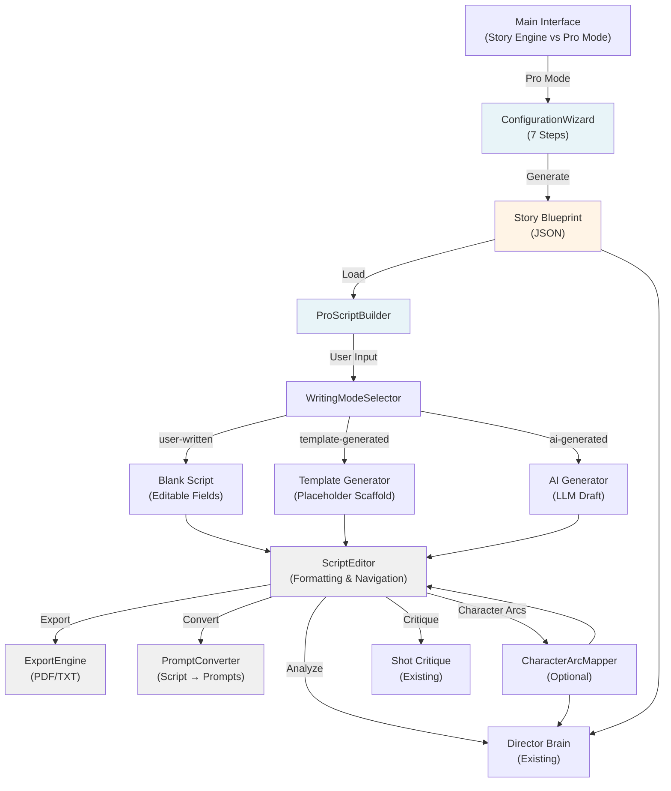
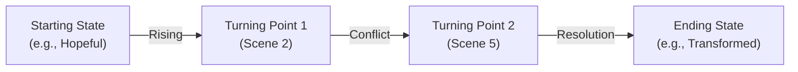

# Design Document: Story Blueprint Engine & Pro Script Builder

## Overview

The Story Blueprint Engine transforms MOKHA FILM Suite's Story Engine from a prompt-writing tool into a professional scriptwriting platform. It combines a 7-step configuration wizard that generates a structured Story Blueprint with a Final Draft-style Pro Script Builder where writers compose fully formatted scripts. The system supports three writing modes (user-written primary, template-generated secondary, AI-generated tertiary) and integrates seamlessly with existing Director Brain, Shot Critique, and Agentic Mode features.

### Key Design Decisions

1. **Story Blueprint as source of truth** — A modular JSON structure generated by the wizard that drives all downstream UI configuration, scene structure, and character suggestions.
2. **Modular React components** — ConfigurationWizard, ProScriptBuilder, WritingModeSelector, CharacterArcMapper, and ExportEngine as composable, reusable components.
3. **Pure JS modules for business logic** — PromptConverter, ExportEngine, and ScriptParser as synchronous, stateless utilities (following FastBrain pattern).
4. **Single-file HTML architecture** — All code in `<script type="text/babel">` with no new npm dependencies.
5. **State preservation across mode switches** — Story Blueprint and script content persist when switching between writing modes.
6. **Integration with existing systems** — Director Brain, Shot Critique, and Agentic Mode access Story Blueprint and script data without modification.

---

## Architecture



---

## Components and Interfaces

### 1. ConfigurationWizard (React Component)

**Purpose:** 7-step guided interface that collects story parameters and generates the Story Blueprint.

**Props:**
```js
{
  onComplete: (blueprint: StoryBlueprint) => void,
  onCancel: () => void,
  initialBlueprint?: StoryBlueprint  // For editing existing blueprints
}
```

**State:**
```js
{
  currentStep: 1-7,
  blueprint: StoryBlueprint,
  validationErrors: { [field]: string }
}
```

**Step Breakdown:**

| Step | Field | Options | Validation |
|------|-------|---------|-----------|
| 1 | storyType | Social Media, Short Film, Cinematic Film, Documentary, Commercial, Experimental | Required |
| 2 | duration | 2 min, 5 min, 10 min, 15 min, 30 min, 60 min | Required |
| 3 | style | cinematic, documentary, comedy, drama, 3D anime, 2D animated, etc. | Required |
| 4 | narrativeStructure | protagonist journey, antagonist conflict, ensemble, real event storytelling, etc. | Required |
| 5 | dynamicParameters | Context-dependent (varies by storyType) | All required fields |
| 6 | storyIntent | Text input (100-500 chars) | Required, non-empty |
| 7 | characters | Optional character creation + relationships | Optional |

**Key Methods:**
- `handleNext()` — Validate current step, advance to next
- `handleBack()` — Return to previous step with data preserved
- `handleSkipCharacters()` — Skip character creation, generate blueprint
- `generateBlueprint()` — Create Story Blueprint JSON, call `onComplete()`

**Dynamic Parameters Logic:**
```js
const getDynamicParameters = (storyType, duration, style, narrativeStructure) => {
  if (storyType === 'Documentary') {
    return {
      subjectMatter: { type: 'select', options: [...] },
      interviewFormat: { type: 'select', options: [...] },
      archivalFootage: { type: 'boolean' },
      narratorPresence: { type: 'select', options: [...] }
    };
  }
  if (storyType === 'Commercial') {
    return {
      productCategory: { type: 'text' },
      targetAudience: { type: 'select', options: [...] },
      callToActionType: { type: 'select', options: [...] },
      brandTone: { type: 'select', options: [...] }
    };
  }
  // ... more story types
};
```

---

### 2. ProScriptBuilder (React Component)

**Purpose:** Final Draft-style scriptwriting interface with real-time formatting, page count, and runtime estimation.

**Props:**
```js
{
  blueprint: StoryBlueprint,
  onSave: (script: ScriptDocument) => void,
  onExport: (format: 'pdf' | 'txt') => void,
  onConvertToPrompts: () => void
}
```

**State:**
```js
{
  script: ScriptDocument,
  writingMode: 'user-written' | 'template-generated' | 'ai-generated',
  selectedSceneId: string | null,
  selectedShotId: string | null,
  pageCount: number,
  estimatedRuntime: number,
  characterArcData: CharacterArcData | null,
  directorBrainOpen: boolean,
  shotCritiqueOpen: boolean
}
```

**Key Methods:**
- `generateSceneStructure()` — Create initial scene structure based on blueprint
- `handleFieldChange(sceneId, shotId, field, value)` — Update script content
- `handleKeyboardShortcut(key)` — Ctrl+H (heading), Ctrl+A (action), Ctrl+D (dialogue)
- `calculatePageCount()` — Estimate pages based on content
- `calculateRuntime()` — Estimate runtime (1 page ≈ 1 minute)
- `switchWritingMode(mode)` — Change mode while preserving content
- `openDirectorBrain()` — Pass script to Director Brain
- `openShotCritique(shotId)` — Pass shot to Shot Critique

**Scene Structure Generation:**
```js
const generateSceneStructure = (blueprint) => {
  const { narrativeStructure, duration } = blueprint;
  const sceneCount = getSceneCountForDuration(duration);
  
  if (narrativeStructure === 'protagonist journey') {
    return [
      { label: 'Inciting Incident', shots: [] },
      { label: 'Rising Action', shots: [] },
      { label: 'Midpoint', shots: [] },
      { label: 'Climax', shots: [] },
      { label: 'Resolution', shots: [] }
    ];
  }
  // ... more narrative structures
};
```

---

### 3. WritingModeSelector (React Component)

**Purpose:** Toggle between user-written, template-generated, and AI-generated modes.

**Props:**
```js
{
  currentMode: 'user-written' | 'template-generated' | 'ai-generated',
  blueprint: StoryBlueprint,
  script: ScriptDocument,
  onModeChange: (mode, newScript) => void
}
```

**Modes:**

**User-Written (Primary, Default):**
- Blank script structure with empty editable fields
- No auto-generation
- Real-time formatting assistance
- Full scene management (add, delete, reorder)

**Template-Generated (Secondary):**
- Display list of templates matching blueprint
- Populate script with placeholder entries (e.g., "[SCENE HEADING]", "[ACTION]")
- Allow customization of placeholders
- Preserve template structure but allow scene management

**AI-Generated (Tertiary):**
- Confirmation dialog before generation
- Send blueprint + storyIntent to LLM
- Parse LLM response into script structure
- Mark fields as AI-generated (optional visual indicator)
- Allow full editing after generation

**Key Methods:**
- `generateFromTemplate(templateId)` — Load template scaffold
- `generateWithAI()` — Call LLM, parse response, populate script
- `switchMode(newMode)` — Preserve content when switching

---

### 4. ScriptEditor (React Component)

**Purpose:** Core editing interface with field-level formatting and navigation.

**Props:**
```js
{
  script: ScriptDocument,
  blueprint: StoryBlueprint,
  onScriptChange: (script: ScriptDocument) => void
}
```

**Editable Fields:**
- Scene Heading (auto-uppercase, screenplay formatting)
- Action Line (left-aligned, single-spaced)
- Character Name (auto-uppercase)
- Parenthetical (centered, screenplay formatting)
- Dialogue (left-aligned, screenplay formatting)

**Auto-Formatting Rules:**
```js
const formatSceneHeading = (text) => text.toUpperCase();
const formatCharacterName = (text) => text.toUpperCase();
const formatDialogue = (text) => text; // Preserve case
const formatParenthetical = (text) => text.toLowerCase();
```

**Keyboard Navigation:**
- Tab/Enter: Move to next field
- Shift+Tab: Move to previous field
- Ctrl+H: Insert Scene Heading
- Ctrl+A: Insert Action Line
- Ctrl+D: Insert Dialogue Block
- Ctrl+Z: Undo (via saveToHistory)
- Ctrl+Y: Redo (via saveToHistory)

**Key Methods:**
- `handleFieldChange(sceneId, shotId, field, value)` — Update field with formatting
- `handleKeyDown(event)` — Process keyboard shortcuts
- `moveToNextField(currentField)` — Navigate between fields
- `insertElement(type)` — Add new scene/shot/dialogue block

---

### 5. CharacterArcMapper (React Component)

**Purpose:** Optional deep feature for mapping character arcs with emotional beats.

**Props:**
```js
{
  blueprint: StoryBlueprint,
  script: ScriptDocument,
  onArcUpdate: (arcData: CharacterArcData) => void
}
```

**State:**
```js
{
  selectedCharacterId: string | null,
  arcData: CharacterArcData,
  showDiagram: boolean
}
```

**Character Arc Data Structure:**
```js
{
  characterId: string,
  startingState: string,
  endingState: string,
  keyTurningPoints: [
    { sceneId: string, description: string }
  ],
  emotionalBeats: {
    [sceneId]: string  // Emotional state at each scene
  }
}
```

**Key Methods:**
- `defineArc(characterId)` — Create new arc for character
- `setEmotionalBeat(sceneId, emotion)` — Set emotion at scene
- `generateArcDiagram()` — Render visual arc representation
- `validateArcConsistency()` — Check for logical progression

**Arc Diagram (Mermaid):**


---

### 6. ExportEngine (Pure JS Module)

**Purpose:** Generate PDF and TXT exports with proper screenplay formatting.

**API:**
```js
const ExportEngine = {
  // Generate PDF with screenplay formatting
  exportPDF(script, blueprint, options) {
    // Returns Blob
  },

  // Generate TXT with text-based formatting
  exportTXT(script, blueprint, options) {
    // Returns string
  },

  // Generate title page
  generateTitlePage(blueprint) {
    // Returns HTML
  },

  // Generate table of contents
  generateTableOfContents(script) {
    // Returns HTML
  }
};
```

**PDF Export Structure:**
1. Title page (project name, author, date)
2. Table of contents (if script > 10 pages)
3. Script content with proper formatting
4. Page numbers and headers

**TXT Export Structure:**
```
PROJECT TITLE
By Author Name
Date

INT. COFFEE SHOP - DAY

John sits at a table, waiting.

JOHN
(nervously)
She's late.

[Page break]
...
```

**Screenplay Formatting Rules:**
- Scene Heading: All caps, left margin 0.5"
- Action: Left margin 0.5", single-spaced
- Character Name: All caps, centered (3.7")
- Parenthetical: Centered (3.2"), lowercase
- Dialogue: Left margin 2.5", right margin 2.5"
- Page breaks: After ~55 lines of content

---

### 7. PromptConverter (Pure JS Module)

**Purpose:** Convert completed script into shot-by-shot prompts for Director Brain.

**API:**
```js
const PromptConverter = {
  // Parse script into scenes and shots
  parseScript(script) {
    // Returns SceneShot[]
  },

  // Generate prompts from scenes/shots
  generatePrompts(sceneShots, blueprint) {
    // Returns Prompt[]
  },

  // Flag ambiguous scenes
  flagAmbiguities(sceneShots) {
    // Returns AmbiguityFlag[]
  }
};
```

**SceneShot Structure:**
```js
{
  sceneId: string,
  sceneHeading: string,
  shots: [
    {
      shotId: string,
      shotType: string,  // Inferred from action (e.g., "wide", "close-up")
      action: string,
      characters: string[],
      dialogue: string
    }
  ]
}
```

**Prompt Generation:**
```js
const generatePrompts = (sceneShots, blueprint) => {
  return sceneShots.flatMap(scene =>
    scene.shots.map(shot => ({
      sceneNumber: scene.sceneId,
      shotType: shot.shotType,
      location: extractLocation(scene.sceneHeading),
      characters: shot.characters,
      action: shot.action,
      dialogue: shot.dialogue,
      style: blueprint.style,
      intent: blueprint.storyIntent
    }))
  );
};
```

**Ambiguity Detection:**
- Scene heading missing location or time
- Action line too vague or incomplete
- Dialogue without character name
- Missing establishing shot before interior scene

---

### 8. ScriptParser (Pure JS Module)

**Purpose:** Parse screenplay text into structured scene/shot/dialogue objects.

**API:**
```js
const ScriptParser = {
  // Parse screenplay text into structured format
  parse(text) {
    // Returns ScriptDocument
  },

  // Detect screenplay element type
  detectElementType(line) {
    // Returns 'heading' | 'action' | 'character' | 'dialogue' | 'parenthetical'
  },

  // Validate screenplay structure
  validate(script) {
    // Returns ValidationResult
  }
};
```

**Element Detection Rules:**
- Scene Heading: Starts with INT./EXT., all caps
- Action: Left-aligned, not all caps, not dialogue
- Character Name: All caps, centered, followed by dialogue
- Parenthetical: Lowercase, in parentheses, between character and dialogue
- Dialogue: Text following character name

---

## Data Models

### Story Blueprint JSON Schema

```js
{
  id: string,                    // Unique identifier (UUID)
  storyType: string,             // Social Media, Short Film, Cinematic Film, etc.
  duration: string,              // 2 min, 5 min, 10 min, 15 min, 30 min, 60 min
  style: string,                 // cinematic, documentary, comedy, drama, etc.
  narrativeStructure: string,    // protagonist journey, antagonist conflict, ensemble, etc.
  dynamicParameters: {           // Context-dependent parameters
    [key: string]: any
  },
  storyIntent: string,           // Emotional/thematic goal (100-500 chars)
  characters: [
    {
      id: string,
      name: string,
      archetype: string,         // protagonist, antagonist, mentor, love interest, etc.
      age: number | string,
      role: string,
      description: string,
      arc?: CharacterArcData
    }
  ],
  relationships: [
    {
      characterId1: string,
      characterId2: string,
      relationshipType: string,  // mentor/student, love interest, antagonist, etc.
      description: string
    }
  ],
  createdAt: string,             // ISO-8601 timestamp
  updatedAt: string              // ISO-8601 timestamp
}
```

### Script Document Structure

```js
{
  id: string,                    // Unique identifier
  blueprintId: string,           // Reference to Story Blueprint
  title: string,
  author: string,
  scenes: [
    {
      id: string,
      label: string,             // Inciting Incident, Rising Action, etc.
      shots: [
        {
          id: string,
          sceneHeading: string,   // INT. COFFEE SHOP - DAY
          action: string,         // Narrative description
          dialogueBlocks: [
            {
              id: string,
              characterName: string,
              parenthetical: string,
              dialogue: string,
              source: 'user-written' | 'template' | 'ai-generated'
            }
          ]
        }
      ]
    }
  ],
  metadata: {
    pageCount: number,
    estimatedRuntime: number,    // In minutes
    wordCount: number,
    lastModified: string,
    writingMode: 'user-written' | 'template-generated' | 'ai-generated'
  }
}
```

### Character Arc Data

```js
{
  characterId: string,
  startingEmotionalState: string,
  endingEmotionalState: string,
  keyTurningPoints: [
    {
      sceneId: string,
      description: string,
      emotionalShift: string
    }
  ],
  emotionalBeats: {
    [sceneId]: string            // Emotional state at each scene
  },
  arcType: 'positive' | 'negative' | 'flat' | 'complex'
}
```

---

## Integration Architecture

### Director Brain Integration

**Data Flow:**
1. User clicks "Director Brain" in ProScriptBuilder
2. ProScriptBuilder passes `{ script, blueprint, characterArcData }` to Director Brain
3. Director Brain analyzes script using existing BrainRouter
4. Director Brain renders Action_Cards for proposed changes
5. User confirms action → ExecutionEngine applies change to script
6. Script updates in ProScriptBuilder

**Access Points:**
- Script content (full text)
- Story Blueprint (context for feedback)
- Character Arc data (for character consistency analysis)
- Scene structure (for pacing/structure analysis)

**Feedback Categories:**
- Pacing and rhythm
- Structure and story beats
- Character arcs and consistency
- Visual storytelling and coverage
- Alignment with Story Intent

---

### Shot Critique Integration

**Data Flow:**
1. User selects shot description in ProScriptBuilder
2. User clicks "Critique Shot"
3. ProScriptBuilder extracts shot action and passes to Shot Critique
4. Shot Critique analyzes shot using existing critique engine
5. User refines shot in Shot Critique
6. User updates shot description in ProScriptBuilder

**Shot Data Passed:**
- Scene heading (location, time)
- Action line (shot description)
- Characters present
- Dialogue (if any)

---

### Agentic Mode Integration

**Data Flow:**
1. Director Brain proposes action (e.g., "Add establishing shot before Scene 3")
2. Action_Card rendered in Director Brain panel
3. User clicks Confirm
4. ExecutionEngine validates and applies action to script
5. ProScriptBuilder updates with new content
6. Action logged to session history (for undo/redo)

**Action Types for Scripts:**
- `ADD_SCENE` — Insert new scene at position
- `ADD_SHOT` — Insert new shot in scene
- `REWRITE_SHOT` — Apply style/rewrite to shot
- `DELETE_SHOT` — Remove shot from scene
- `REORDER_SHOTS` — Move shot to new position
- `SET_FIELD` — Update specific field (heading, action, dialogue)
- `APPLY_STYLE` — Apply director style to multiple shots

---

## State Management Strategy

### Component State Hierarchy

```
App (Main Interface)
├── ProMode (Entry Point)
│   ├── ConfigurationWizard (Step 1-7)
│   │   └── blueprint: StoryBlueprint
│   └── ProScriptBuilder (Main Editor)
│       ├── script: ScriptDocument
│       ├── writingMode: string
│       ├── selectedSceneId: string
│       ├── characterArcData: CharacterArcData
│       ├── ScriptEditor
│       │   └── Handles field-level edits
│       ├── WritingModeSelector
│       │   └── Manages mode switching
│       ├── CharacterArcMapper (Optional)
│       │   └── Arc visualization
│       └── DirectorBrainPanel (Existing)
│           └── Integrated for feedback
```

### State Persistence

**Session-Scoped:**
- Story Blueprint (in memory)
- Script Document (in memory)
- Character Arc data (in memory)
- Undo/redo stack (in memory)

**Project-Scoped (via existing saveToHistory):**
- Script content (persisted to project state)
- Blueprint (persisted to project state)
- Character Arc data (persisted to project state)

**Not Persisted:**
- Director Brain feedback history (session-only)
- Shot Critique feedback (session-only)
- Agentic Mode action log (session-only)

---

## Error Handling Strategy

### Validation Errors

**Configuration Wizard:**
- Missing required field → Display error message, disable Next button
- Invalid input format → Display inline error, highlight field
- Duplicate character name → Display warning, allow override

**Pro Script Builder:**
- Invalid scene structure → Display warning, suggest fix
- Ambiguous shot description → Flag for prompt conversion
- Export failure → Display error, suggest retry or alternative format

### Runtime Errors

**Template Generation:**
- Template not found → Display error, offer alternatives
- Template parsing failure → Fall back to blank script

**AI Generation:**
- LLM timeout → Display error, allow retry
- LLM parsing failure → Display error, allow manual entry
- Invalid response format → Display error, suggest manual entry

**Export:**
- PDF generation failure → Display error, offer TXT alternative
- File download failure → Display error, suggest copy-to-clipboard

**Prompt Conversion:**
- Ambiguous scenes detected → Display list, ask for clarification
- Parsing failure → Display error, suggest manual review

---

## Performance Optimization Strategy

### Lazy Loading

- CharacterArcMapper: Load only when user clicks "Character Arcs"
- Director Brain panel: Load only when user clicks "Director Brain"
- Shot Critique panel: Load only when user clicks "Critique Shot"

### Debouncing

- Auto-formatting: Debounce field changes (100ms)
- Page count calculation: Debounce on content change (200ms)
- Runtime estimation: Debounce on content change (200ms)

### Caching

- Template definitions: Cache in memory on first load
- Scene structure templates: Cache based on narrative structure
- Character suggestions: Cache based on story type

### Optimization Techniques

- Memoize component renders (React.memo for ScriptEditor fields)
- Use useCallback for event handlers
- Virtualize long script lists (if script > 50 scenes)
- Batch state updates (React 18 automatic batching)

---

## Correctness Properties

*A property is a characteristic or behavior that should hold true across all valid executions of a system—essentially, a formal statement about what the system should do. Properties serve as the bridge between human-readable specifications and machine-verifiable correctness guarantees.*

### Property 1: Story Blueprint Completeness

**For any** configuration wizard completion through all 7 steps, the generated Story Blueprint SHALL contain all required fields (id, storyType, duration, style, narrativeStructure, storyIntent, characters, relationships) with non-empty values for required fields.

**Validates: Requirements 1.2, 2.2, 3.2, 4.2, 5.5, 6.3, 7.4, 8.1**

### Property 2: Wizard Selection Persistence

**For any** sequence of wizard steps, when the user navigates backward and then forward again, all previously selected values SHALL be restored to their original state.

**Validates: Requirements 1.5, 2.5, 3.5, 4.5, 5.7, 6.5**

### Property 3: Dynamic Parameters Correctness

**For any** combination of storyType, duration, style, and narrativeStructure, the displayed Dynamic_Parameters SHALL match the expected parameter set for that combination, and all parameters SHALL be stored in the Story_Blueprint.

**Validates: Requirements 5.1, 5.2, 5.3, 5.4, 5.5**

### Property 4: Scene Heading Auto-Formatting

**For any** text entered into a Scene_Heading field, the displayed text SHALL be converted to uppercase and formatted according to screenplay conventions (INT./EXT. LOCATION - TIME).

**Validates: Requirement 9.3**

### Property 5: Dialogue Block Formatting

**For any** dialogue block entered (character name, parenthetical, dialogue text), the character name SHALL be uppercase, the parenthetical SHALL be centered and lowercase, and the dialogue SHALL be left-aligned.

**Validates: Requirement 9.5**

### Property 6: Script Structure Adaptation

**For any** Story_Blueprint with a given narrativeStructure and duration, the generated script structure SHALL contain the correct number of scenes (within the expected range for that duration) with appropriate scene labels matching the narrative structure.

**Validates: Requirements 10.1, 10.2, 10.3, 10.4, 10.5**

### Property 7: Mode Switching Preservation

**For any** script content, switching between writing modes (user-written ↔ template-generated ↔ ai-generated) and back again SHALL preserve all user-entered content without loss or corruption.

**Validates: Requirements 11.6, 12.5, 13.5**

### Property 8: Export Format Fidelity

**For any** script exported to PDF or TXT format, the exported document SHALL preserve all screenplay formatting rules (scene headings uppercase, action left-aligned, dialogue centered, proper page breaks).

**Validates: Requirement 14.2, 14.3, 14.5, 14.6**

### Property 9: Prompt Conversion Completeness

**For any** script converted to prompts, each generated prompt SHALL contain all required fields (sceneNumber, shotType, location, characters, action, dialogue) extracted from the corresponding script section.

**Validates: Requirement 15.4**

### Property 10: Character Arc Consistency

**For any** character arc defined with starting and ending emotional states, the emotional beats at each scene SHALL form a logical progression without contradictory transitions between consecutive scenes.

**Validates: Requirement 16.2, 16.3**

### Property 11: Blueprint Schema Extensibility

**For any** new Story_Type added to the system, the Story_Blueprint schema SHALL NOT require modification—only the Configuration_Wizard logic and template definitions need to be updated.

**Validates: Requirement 8.5**

### Property 12: Blueprint-UI Configuration Alignment

**For any** Story_Blueprint loaded into the Pro Script Builder, the UI configuration (scene structure, character suggestions, style recommendations) SHALL match the blueprint's storyType, narrativeStructure, and duration.

**Validates: Requirements 8.6, 9.1**

### Property 13: Keyboard Navigation Correctness

**For any** sequence of Tab/Enter key presses in the Pro Script Builder, the focus SHALL move to the next appropriate field in the correct order (Scene_Heading → Action_Line → Character_Name → Parenthetical → Dialogue).

**Validates: Requirement 9.6**

### Property 14: Page Count Accuracy

**For any** script content, the calculated page count SHALL be within ±1 page of the actual page count when exported to PDF (accounting for formatting variations).

**Validates: Requirement 9.7**

### Property 15: Character Reference Validity

**For any** script document, all character names referenced in dialogue blocks SHALL correspond to characters defined in the Story_Blueprint or added by the user in the Pro Script Builder.

**Validates: Requirement 9.2**

---

## Testing Strategy

### Unit Tests

**Configuration Wizard:**
- Step validation (required fields, navigation)
- Blueprint generation (correct structure, all fields populated)
- Dynamic parameter logic (correct parameters for each story type)
- Character creation and relationship definition

**Pro Script Builder:**
- Scene structure generation (correct structure for narrative type)
- Field formatting (auto-uppercase, centering, alignment)
- Keyboard shortcuts (correct field insertion and navigation)
- Page count and runtime calculation

**Writing Modes:**
- Template generation (correct placeholder insertion)
- AI generation (correct LLM response parsing)
- Mode switching (content preservation)

**Export Engine:**
- PDF generation (correct formatting, page breaks, title page)
- TXT generation (correct text-based formatting)
- File naming and download

**Prompt Converter:**
- Script parsing (correct scene/shot extraction)
- Prompt generation (all required fields present)
- Ambiguity detection (correct flagging of incomplete scenes)

**Character Arc Mapper:**
- Arc creation and editing
- Emotional beat assignment
- Arc diagram rendering
- Consistency validation

### Integration Tests

**Director Brain Integration:**
- Script pre-loading into Director Brain
- Action card rendering and confirmation
- Script update after action confirmation
- Undo/redo with Director Brain actions

**Shot Critique Integration:**
- Shot extraction and passing to Shot Critique
- Shot refinement and update back to script

**Agentic Mode Integration:**
- Action proposal rendering
- Action confirmation and execution
- Session log tracking

### Property-Based Tests

**Property 1: Blueprint Completeness**
- Generate random wizard inputs
- Verify all required fields in output blueprint
- Verify no null/undefined values

**Property 2: Script Structure Validity**
- Generate random script modifications
- Verify all scene references are valid
- Verify all character references are valid

**Property 3: Export Fidelity**
- Generate random scripts with various content
- Export to PDF and TXT
- Verify formatting matches on-screen display

**Property 4: Character Arc Consistency**
- Generate random character arcs
- Verify emotional progression is logical
- Verify no contradictory transitions

**Property 5: Mode Switching Preservation**
- Generate random script content
- Switch between modes multiple times
- Verify content is preserved after each switch

**Property 6: Prompt Conversion Accuracy**
- Generate random scripts
- Convert to prompts
- Verify all required fields present in each prompt

**Property 7: Integration Safety**
- Generate random Director Brain actions
- Apply actions to script
- Verify script structure remains valid

---

## Implementation Roadmap

### Phase 1: Core Components (Weeks 1-2)
- ConfigurationWizard (7 steps)
- Story Blueprint JSON schema
- ProScriptBuilder basic structure
- ScriptEditor with field formatting

### Phase 2: Writing Modes (Weeks 3-4)
- User-written mode (default)
- Template-generated mode
- AI-generated mode
- Mode switching with content preservation

### Phase 3: Export & Conversion (Weeks 5-6)
- ExportEngine (PDF and TXT)
- PromptConverter (script → prompts)
- ScriptParser (screenplay parsing)

### Phase 4: Optional Features (Weeks 7-8)
- CharacterArcMapper
- Character arc visualization
- Arc consistency validation

### Phase 5: Integration (Weeks 9-10)
- Director Brain integration
- Shot Critique integration
- Agentic Mode integration
- Action card rendering and execution

### Phase 6: Testing & Polish (Weeks 11-12)
- Unit tests for all components
- Integration tests
- Property-based tests
- Performance optimization
- UI/UX refinement

---

## Appendix: Screenplay Formatting Reference

### Standard Screenplay Format

**Scene Heading:**
- All caps
- Format: INT./EXT. LOCATION - TIME OF DAY
- Example: INT. COFFEE SHOP - DAY

**Action:**
- Left-aligned
- Single-spaced
- Describes what happens on screen

**Character Name:**
- All caps
- Centered (3.7" from left)
- Appears above dialogue

**Parenthetical:**
- Lowercase
- Centered (3.2" from left)
- Actor direction (e.g., "(beat)", "(whispers)")

**Dialogue:**
- Left-aligned (2.5" from left)
- Right margin 2.5"
- Spoken words

**Page Breaks:**
- Approximately 55 lines per page
- Avoid breaking dialogue blocks

### Example Script Page

```
INT. COFFEE SHOP - DAY

John sits at a table, nervously checking his watch. The door opens.

JOHN
(standing)
You came.

SARAH
(sitting)
I almost didn't.

JOHN
I'm glad you did.

Sarah looks away, conflicted.

SARAH
This is a mistake.

JOHN
(reaching for her hand)
Is it?

Sarah pulls her hand back.

SARAH
We can't do this.

She stands and walks toward the door.

JOHN
(calling after her)
Sarah, wait!

But she's already gone. John sits back down, defeated.

FADE OUT.
```

